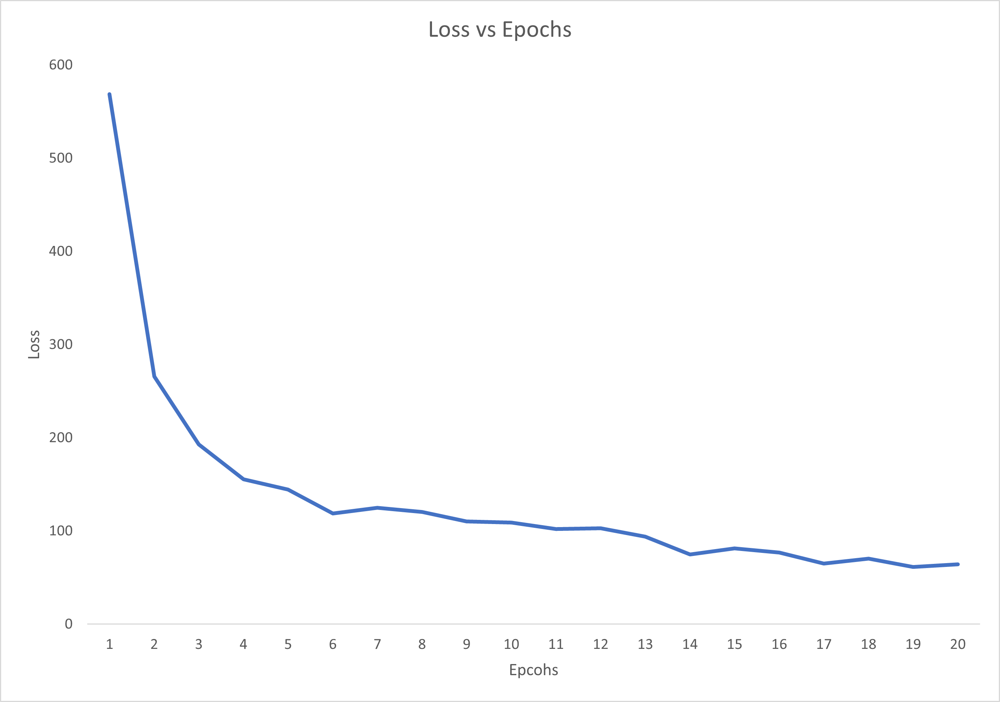
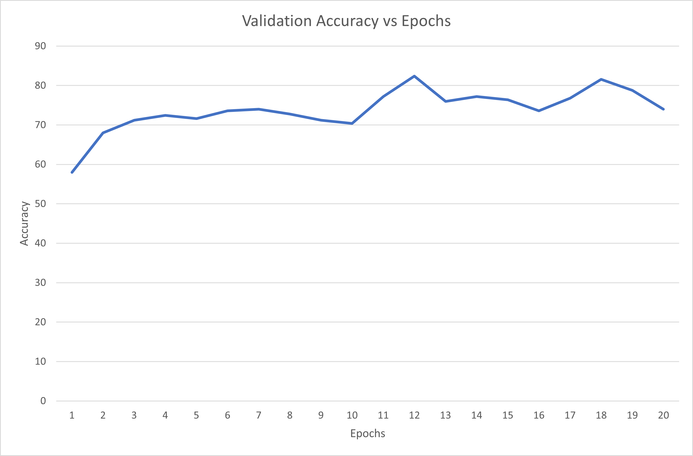

# HPML-Final-Project-Spring-2022
The repo for Siamese Neural Networks by Kaushik Venkatesh (kpv222) and Satya Pranav Akurati (spa9633)

This project implemets and trains a SNN in Google Colab on one GPU. The dataset used is Omniglot, and the repo contains a notebook with L1/L2 and RBF Loss, one notebook with triplet loss and one notebook with cosine similarity.

## To run this code
In order to run the code, please download the Omniglot dataset and store it in your drive. Upload the notebook to Google Colab and run the notebook.

## Results
### For Triplet Loss:

### For Cosine Similarity:

